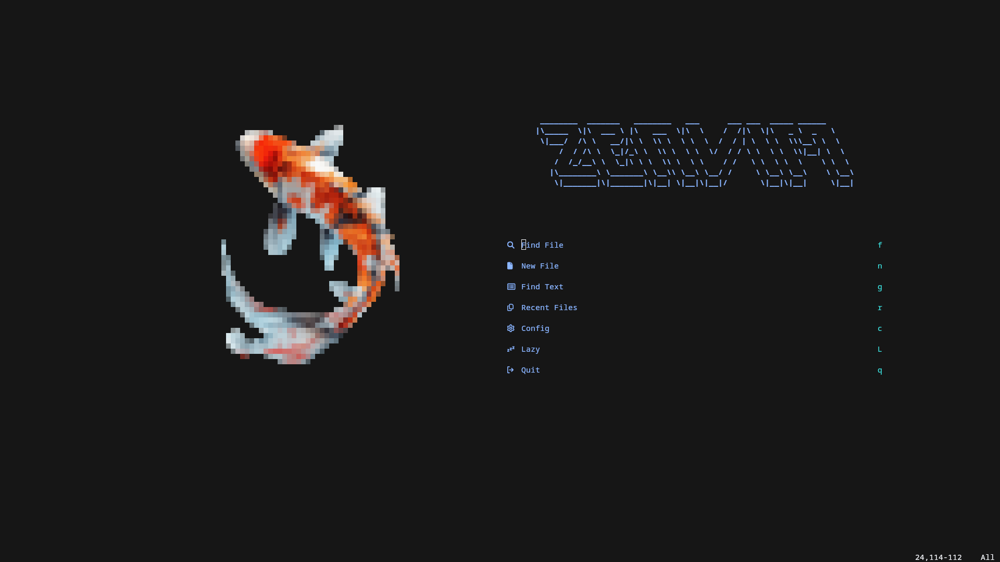

<h1 align="center" style="color: #ffb3c6">ZeNvim 🪷</h1>
<h3 align="center" style="padding-bottom: 10px;">The Neovim config that keeps you stress free</h3>
<p align="center">

</p>
<h3 style="color: #d4a373;">📦 Plugins list</h3>

### UI
- bufferline
- lualine
- nvim-web-devicons
- nightfox
### Autocompletion / LSP
- mason
- mason-lspconfig
- nvim-cmp
- nvim-lspconfig
- cmp-nvim-lsg
- cmp-buffer
- cmp-path
- cmp-cmdline
- luasnip
- cmp_luasnip
### Parsing / Render
- treesitter
- render-markdown
### Blazingly Fast Programmer
- harpoon
- telescope
- ripgrep
- telescope-fzf-native
### Others
- plenary
- snacks

<h3 style="color: #bde0fe;">⚙️ Installation</h3>

### Prerequisites

- **Neovim** 0.11+

Other requirements may apply ( I suggest you do `:checkhealth` to spot what's missing on your system)

### Quick Install

**! If you already have a Neovim config, I advise you to make a backup in case you don't like mine**

You can do so with the following command:
```bash
mv ~/.config/nvim ~/.config/nvim.bak
```
<i>If you are on Windows, this won't work right away.<br>
You first need to uninstall Windows<br>
Install a Linux distro except HannahMontana Linux (it doesn't work on this one, I can't figure why)
</i>


You can use the following command to install this config:
```bash
git clone https://github.com/Th3FatRa7/zenvim.git ~/.config/nvim
```

---
If you happen to like this config but don't understand the keybinds, open an issue and I'll add documentation for them.
